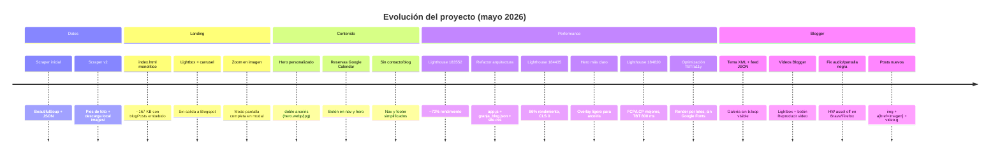
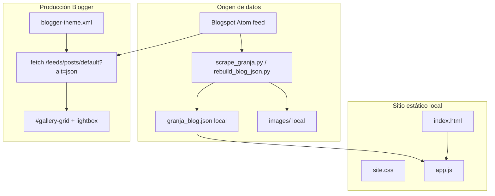
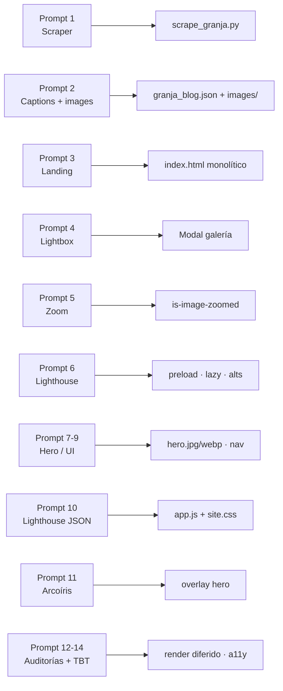
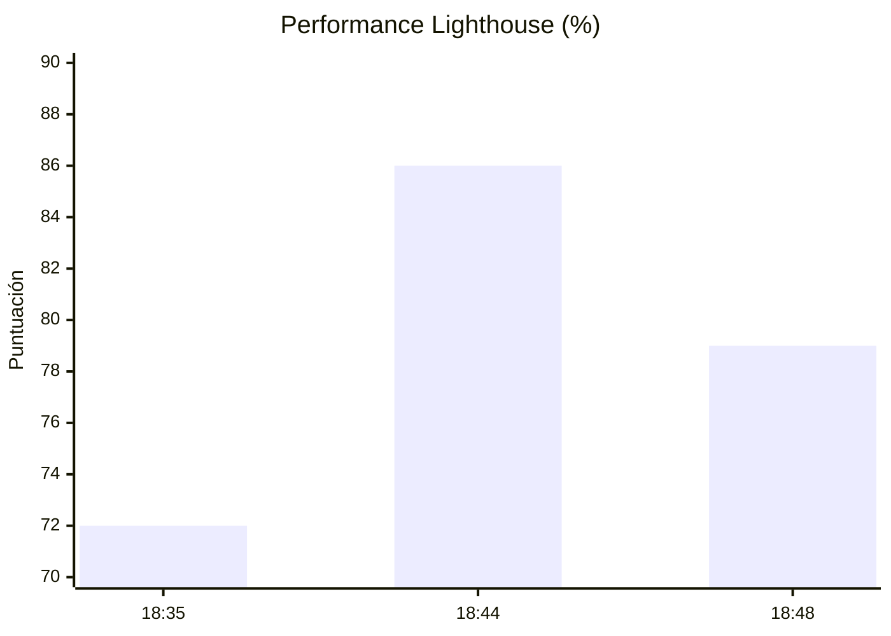
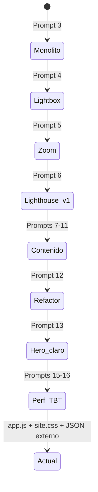

# Documentación de prompts — Granja Detrás de la Luna

Registro de la conversación de desarrollo entre el usuario y el agente de Cursor para el proyecto **granja2** (landing + scraper del blog [Granja Detrás de la Luna](https://granjadetrasdelaluna.blogspot.com/)).

**Transcripción completa:** [970bf5b2-2280-4f27-aea8-9250d905b53b](970bf5b2-2280-4f27-aea8-9250d905b53b)

**Fecha de la sesión:** 30–31 de mayo de 2026

**Repositorio GitHub:** [godofredosecas-web/granja-detras-luna-blogger](https://github.com/godofredosecas-web/granja-detras-luna-blogger) — este directorio (`granja2`) reemplaza el contenido anterior del repo (tema temazcal/galería antigua).

**Carpeta de trabajo local:** `/home/cachis/Cursor/granja2`

---

## Resumen ejecutivo

| Fase | Enfoque | Resultado principal |
|------|---------|---------------------|
| 1 | Backend / datos | Scraper Python → `granja_blog.json` + `images/` |
| 2 | Frontend | Landing mística con Tailwind, bitácora embebida |
| 3 | UX | Lightbox con carrusel y zoom |
| 4 | Contenido / navegación | Hero, reservas, limpieza de secciones |
| 5 | Performance | Arquitectura liviana, Lighthouse |
| 6 | Pulido visual + a11y | Arcoíris visible, TBT, contraste, fuentes locales |
| 7 | Blogger en producción | `blogger-theme.xml`, feed Atom, galería en vivo |
| 8 | Vídeos + entradas nuevas | `video.g`, YouTube, enlaces `<a href="*.jpg">`, fixes Brave/Linux |

---

## Timeline de la sesión



---

## Arquitectura actual (post-refactor)



### Producción vs local

| Entorno | Fuente de posts | Galería |
|---------|-----------------|---------|
| **Blogspot** (`granjadetrasdelaluna.blogspot.com`) | Feed Atom en `blogger-theme.xml` | `#gallery-grid` + lightbox en el tema |
| **Local** (`python3 -m http.server`) | `granja_blog.json` vía `app.js` | Misma lógica sincronizada en `app.js` |

---

## Flujo de prompts → entregables



---

## Estadísticas del proyecto

### Datos scrapeados

| Métrica | Valor |
|---------|-------|
| Posts en bitácora | 56+ (crece con entradas nuevas en Blogger) |
| Imágenes locales | ~583 archivos (generado) |
| Vídeos en feed | 2 históricos (Walipini YouTube, Trabajo en equipo `video.g`) + entradas de prueba |
| Tamaño `granja_blog.json` | ~290 KB (generado) |
| Tema Blogger | `blogger-theme.xml` (~1260 líneas) |
| Script scraper | `scrape_granja.py` + `scripts/rebuild_blog_json.py` |

### Evolución del peso de `index.html`

| Estado | Tamaño aprox. | Notas |
|--------|---------------|-------|
| Monolítico (JSON embebido) | **~167 KB** | `const blogPosts = [...]` inline |
| Arquitectura separada | **~19 KB** | Solo markup + CSS crítico inline |

### Stack de assets actuales

| Archivo | Tamaño | Rol |
|---------|--------|-----|
| `index.html` | ~18.7 KB | Estructura, hero, lightbox, CSS crítico |
| `site.css` | ~20.6 KB | Tailwind compilado (sin CDN en runtime) |
| `app.js` | ~12.9 KB | Bitácora, lightbox, menú |
| `granja_blog.json` | ~144.9 KB | Carga diferida vía `fetch` |
| `images/hero.webp` | ~28.3 KB | LCP optimizado (preload) |
| `images/hero.jpg` | ~67.2 KB | Fallback `<picture>` |

### Informes Lighthouse (localhost:8080, móvil simulado)

| Archivo reporte | Hora (UTC) | Performance | FCP | LCP | CLS | TBT | Notas |
|-----------------|------------|-------------|-----|-----|-----|-----|-------|
| `localhost_8080-20260530T183552.json` | ~18:35 | **~72%** | ~3.5 s | ~4.1 s | ~0.16 | 0 ms | Tailwind CDN + JSON inline |
| `localhost_8080-20260530T184435.json` | ~18:44 | **86%** | 2.9 s | 3.4 s | **0** | 0 ms | Tras refactor CSS/JSON externo |
| `localhost_8080-20260530T184820.json` | ~18:48 | **79%** | **0.9 s** | **2.3 s** | **0** | **800 ms** | JSON + `renderGallery()` síncrono bloqueó hilo |
| *(esperado post-últimos cambios)* | — | ↑ | ↓ | ↓ | 0 | ↓ | Idle + lotes + sin Google Fonts |



> El informe de las 18:48 mejora pintado (FCP/LCP) pero penaliza **TBT** por montar 55 tarjetas de golpe; la solución posterior divide ese trabajo.

---

## Recursos y dependencias

### Python (scraper)

```
.venv/
requirements.txt   → beautifulsoup4, requests
scrape_granja.py   → salida: granja_blog.json, images/
```

### Frontend (build)

```
package.json       → tailwindcss 3.4.17
tailwind.config.js → paleta earth/forest/sand/moon/charcoal
src/input.css      → @tailwind base/components/utilities
bun run build:css  → genera site.css
```

### Servir localmente

```bash
cd /home/cachis/Cursor/granja2
python3 -m http.server 8080
# Requiere: granja_blog.json + images/ + site.css + app.js
```

### Enlaces externos usados en producción

| Uso | URL |
|-----|-----|
| Blog origen | https://granjadetrasdelaluna.blogspot.com/ |
| Reservaciones | https://calendar.app.google/YDDPBgQ76pFZHpHV7 |

### `.gitignore` relevante

- `granja_blog.json`, `images/`, `.venv/`, `node_modules/`

---

## Catálogo de prompts (orden cronológico)

### Prompt 1 — Scraper inicial

> *"Dame un script en Python usando BeautifulSoup para scrapear todo el texto e imágenes de https://granjadetrasdelaluna.blogspot.com/ y guardarlo en un JSON"*

**Intención:** Extraer contenido del blog Blogger para uso offline o en otra UI.

**Acción del agente:**
- Crear `scrape_granja.py` con feed Atom + parsing HTML por post.
- Salida inicial en `granja_blog.json` (estructura con metadatos del blog y arreglo `posts`).

**Entregables:** `scrape_granja.py`, `requirements.txt`, `.venv/`

---

### Prompt 2 — Pies de foto e imágenes locales

> *Modificar el script para: (1) pies de foto de `tr-caption`, (2) descarga en `images/<slug>/fotoN.jpg`, (3) `src` local en JSON. Volver a ejecutar el scraper.*

**Intención:** Datos listos para una galería local sin hotlinking a Blogspot.

**Acción del agente:**
- Parser de `td.tr-caption` → campos `caption`, `description`.
- Descarga organizada por slug; actualización de rutas en JSON.
- Re-ejecución del scrape (~55 posts, cientos de imágenes).

---

### Prompt 3 — Landing monolítica

> *Actúas como Ingeniero Frontend Senior… `index.html` autónomo, estética mística, Tailwind CDN, Playfair + Inter, paleta orgánica, inyectar `granja_blog.json` como `const blogPosts`, secciones Hero / Filosofía / Bitácora / Contacto…*

**Intención:** Sitio de marca “espacio sagrado” con galería dinámica desde datos locales.

**Acción del agente:**
- `index.html` grande con Tailwind vía CDN y JSON embebido.
- Tarjetas de bitácora, búsqueda, filtros (luego simplificados).
- Tipografía y tokens de color personalizados en `tailwind.config` inline.

---

### Prompt 4 — Lightbox en lugar de Blogspot

> *Al clic en tarjetas, no ir a Blogspot: modal con carrusel de todas las `images` del post, flechas, teclado, pies de foto, backdrop blur.*

**Intención:** Experiencia autocontenida en el sitio.

**Acción del agente:**
- Eliminar enlaces externos en tarjetas.
- Modal `#lightbox` con estado `lightboxState`, navegación y captions.

---

### Prompt 5 — Zoom en imagen del lightbox

> *Clic en la foto → expansión fullscreen temporal; icono lupa / `cursor-zoom-in`; al navegar o segundo clic → volver al carrusel.*

**Intención:** UX tipo visor de fotos profesional.

**Acción del agente:**
- Clase `is-image-zoomed`, ocultar chrome del modal, estilos en `<style>` crítico.

---

### Prompt 6 — Optimización Lighthouse (primera pasada)

> *preload hero, `fetchpriority="high"`, `loading="lazy"` en galería, fallback `alt`, scripts defer, `DOMContentLoaded`…*

**Intención:** Subir puntuación de rendimiento y accesibilidad.

**Acción del agente:**
- Preload y prioridad en imagen hero (ruta del post indicada en el prompt).
- Lazy load en imágenes dinámicas; helper `getImageAlt()`.

---

### Prompt 7 — Cambio de foto hero (mayo-2023)

> *Prefiero `images/mayo-2023/foto1.jpg` en lugar de la actual* (+ captura adjunta)

**Intención:** Hero alineado con identidad visual del rancho.

**Acción del agente:** Copia/adaptación de imagen hacia `images/hero.jpg` (y posteriores variantes WebP).

---

### Prompt 8 — Reemplazar hero otra vez

> *"Reemplazala por esta"* (+ nueva imagen: doble arcoíris)

**Intención:** Definitiva imagen de portada con arcoíris.

**Acción del agente:** Actualización de `hero.jpg` / referencias en HTML.

---

### Prompt 9 — Quitar contacto y blog

> *"Remove contacto and blog buttons and sections, please."*

**Intención:** Sitio más enfocado; sin enlaces a Blogger en UI principal.

**Acción del agente:** Eliminación de sección Contacto y enlaces “blog” en nav/tarjetas/footer.

---

### Prompt 10 — Botón de reservas

> *Botón con enlace a calendario: https://calendar.app.google/YDDPBgQ76pFZHpHV7*

**Intención:** Conversión directa a reservación de sesión terapéutica.

**Acción del agente:** CTAs “Reservar” / “Concertar reservación” en hero y menú móvil/desktop.

---

### Prompt 11 — Quitar elemento UI

> *"Quita esto"* (+ captura de filtros por etiquetas)

**Intención:** Simplificar bitácora (solo búsqueda por texto).

**Acción del agente:** Eliminación de filtros por etiquetas en la galería.

---

### Prompt 12 — Mejorar Lighthouse (JSON 183552)

> *`@localhost_8080-20260530T183552.json` Hay que mejorar esto*

**Intención:** Objetivo ~100 % rendimiento según auditoría.

**Diagnóstico (~72% performance):**
- HTML ~167 KB (JSON inline).
- Tailwind CDN ~127 KB + alto coste JS.
- FCP/LCP altos; CLS por fuentes web.

**Acción del agente (iniciada / continuada tras resumen):**
- Externalizar `granja_blog.json` + `app.js`.
- Compilar `site.css` con Tailwind CLI (Bun).
- Hero WebP + `<picture>`, `display=optional` en fuentes.

---

### Prompt 13 — Arcoíris más visible

> *"i want the rainbow to show, its too dark"* (+ captura hero oscuro)

**Intención:** El overlay del hero tapaba el doble arcoíris.

**Acción del agente:**
- Gradiente `hero-gradient` más transparente hacia la derecha.
- `object-position` hacia zona del arcoíris; `brightness`/`saturate` leves.
- Sombra en texto para legibilidad.

---

### Prompt 14 — Revisar informe 184435

> *`Check this @localhost_8080-20260530T184435.json`*

**Intención:** Validar mejoras tras refactor.

**Hallazgos comunicados:**
- **86%** performance, CLS 0, TBT 0.
- FCP 2.9 s, LCP 3.4 s aún mejorables.
- LCP = párrafo del hero (fuentes), no la imagen.
- Sugerencias: fuentes locales, LCP en imagen hero.

---

### Prompt 15 — Revisar informe 184820

> *`new json @localhost_8080-20260530T184820.json`*

**Intención:** Seguimiento tras cambios visuales del hero.

**Hallazgos comunicados:**
- Paradoja: FCP **0.9 s**, LCP **2.3 s**, pero performance **79%**.
- **TBT 800 ms** por tarea larga (~719 ms) al parsear JSON y renderizar 55 tarjetas.
- `granja_blog.json` (~145 KB) cargado en la auditoría.
- 58 fallos de contraste en galería.

---

### Prompt 16 — Implementar optimizaciones TBT y a11y

> *"Si, adelante, por favor."*

**Intención:** Aplicar recomendaciones del informe 184820.

**Acción del agente:**
- `scheduleGalleryLoad()` con `requestIdleCallback`.
- `renderGallery()` en lotes de 5 tarjetas.
- Debounce 150 ms en búsqueda.
- Eliminar Google Fonts; system-ui + Georgia.
- Contraste (`sand/75`, `sand/80`, etc.).
- Quitar `aria-label` conflictivo en tarjetas (nombre desde contenido visible).

---

## Diagrama de estados del `index.html`



---

## Comandos útiles (referencia rápida)

| Tarea | Comando |
|-------|---------|
| Scrapear blog | `.venv/bin/python scrape_granja.py` |
| Reconstruir JSON (recomendado) | `.venv/bin/python scripts/rebuild_blog_json.py` |
| Regenerar CSS | `bun run build:css` |
| Servidor local | `python3 -m http.server 8080` |
| Validar JS | `node --check app.js` |
| Pegar tema en Blogger | Copiar `blogger-theme.xml` → Tema → Editar HTML |
| Brave: vídeo con imagen | Desactivar aceleración HW o `brave --disable-features=AcceleratedVideoDecodeLinuxGL` |

---

## Lecciones aprendidas

1. **JSON embebido en HTML** simplifica despliegue de un solo archivo pero destruye FCP/LCP y tamaño de parseo en móvil.
2. **Tailwind CDN** penaliza TBT y bytes; CSS compilado (~21 KB) es preferible.
3. **LCP puede ser texto** si las fuentes o el copy del hero compiten con la imagen; fuentes del sistema ayudan.
4. **Render masivo post-carga** (55 nodos con `innerHTML`) genera TBT aunque FCP sea excelente → **idle + lotes**.
5. **Overlays fuertes en hero** ocultan el mensaje visual (arcoíris); gradientes asimétricos equilibran marca y foto.
6. **`aria-label` que no incluye el texto visible** falla auditorías de accesibilidad en tarjetas interactivas.
7. **Vídeos `blogger.com/video.g` en iframe** suelen fallar en temas personalizados; el reproductor oficial puede dar **audio sin vídeo** en Linux por decodificación por hardware (Brave), no por el tema.
8. **Enlaces `<a href="foto.jpg">` sin ``** no son imágenes para el parser; hay que usar `` o ampliar `parseImagesFromContent`.
9. **No usar solo `scrape_granja.py` tras el tema custom** si las páginas de entrada no exponen `.post-body`; preferir `rebuild_blog_json.py` desde el feed Atom.

---

### Prompt 17 — Fotos no cargan en Blogspot en vivo

> Galería vacía en `granjadetrasdelaluna.blogspot.com`; arreglar `blogger-theme.xml`.

**Causas y fixes:** espacios/`<?xml` inválido en XML; IIFE del hero rota; `${}` y `$t` incompatibles con Blogger; galería por feed JSON en lugar de `b:loop` roto; preload hero vacío; **Blog1** oculto sin `visible='true'` (sin “Nueva entrada”).

---

### Prompt 18 — Soporte de vídeo

> Vídeos en scraper, tema y sitio local.

**Entregables:** `parseVideosFromContent`, lightbox `#lightbox-video-wrap`, badge play, `scripts/apply_video_support.py`, `rebuild_blog_json.py` con 2 vídeos en JSON.

---

### Prompt 19 — «No se ve el video» (Trabajo en equipo)

> Lightbox muestra «1 video» pero no reproductor.

**Causa:** iframe `video.g` sin `postUrl`, layout con clase `hidden`, miniatura del feed como falsa imagen. **Fix:** vídeos antes que fotos en slides, `bloggerVideoEmbedUrl`, altura mínima iframe, reestructuración `#lightbox-media`.

---

### Prompt 20 — Post nuevo «Hola mundo» con enlace de imagen

> `<a href="https://.../26444.jpg"></a>` no se ve; subir imagen en Blogger pide Google / no hace nada.

**Causa:** solo enlace, no ``. **Fix:** `parseImagesFromContent` detecta `<a href="*.jpg|png|...">` y URLs sueltas. **Blogger:** subir con cuenta del blog; Brave puede bloquear `docs.google.com/picker`.

---

### Prompt 21 — Vídeo subido «hhht»: audio sí, pantalla negra

> En `blogger.com/video.g` y en el lightbox: se oye audio, imagen negra («Este video no está disponible» a veces visible).

**Diagnóstico:** no es fallo del tema en el reproductor oficial de Google; es **decodificación de vídeo en Brave/Linux** (VA-API / GPU). El archivo en el feed es válido (`iframe` `video.g?token=...`).

**Solución confirmada por el usuario:**

1. Desactivar **aceleración por hardware** en Brave: `brave://settings/system`.
2. O lanzar: `brave --disable-features=AcceleratedVideoDecodeLinuxGL`.
3. También verificado en **Firefox** con buen resultado.
4. Alternativas: re-exportar MP4 en H.264 (`ffmpeg -c:v libx264 -pix_fmt yuv420p`) o publicar en **YouTube** e insertar en la entrada.

**Cambio en tema:** botón **▶ Reproducir video**, aviso `blogger-video-hint` con los pasos anteriores; `buildVideoPlayerHtml()` para vídeos `video.g`.

---

### Prompt 22 — Actualizar prompts y repositorio

> Actualizar `prompts.md`; reemplazar repo GitHub con esta carpeta.

**Acción:** documentación ampliada; `README.md`; git en `granja2` → push a `godofredosecas-web/granja-detras-luna-blogger` (sustituye proyecto anterior del mismo remoto).

---

## Archivos clave del repositorio

```
granja2/                          # → github.com/godofredosecas-web/granja-detras-luna-blogger
├── blogger-theme.xml             # Plantilla Blogger (producción)
├── blogger-app.js                # Referencia JS (puede ir desfasado del XML)
├── scrape_granja.py
├── scripts/
│   ├── rebuild_blog_json.py      # Preferido para JSON
│   └── apply_video_support.py
├── granja_blog.json              # Generado (.gitignore)
├── granja-hero-upload.jpg        # Subir a Blogger
├── images/                       # Generado (.gitignore)
├── index.html
├── app.js                        # Paridad con lógica del tema
├── site.css
├── tailwind.config.js
├── src/input.css
├── package.json
├── requirements.txt
├── README.md
└── prompts.md
```

---

*Documento generado a partir de la sesión de Cursor (`970bf5b2-2280-4f27-aea8-9250d905b53b`). Última actualización: 31 mayo 2026 — fase Blogger + vídeos + migración de repo.*
